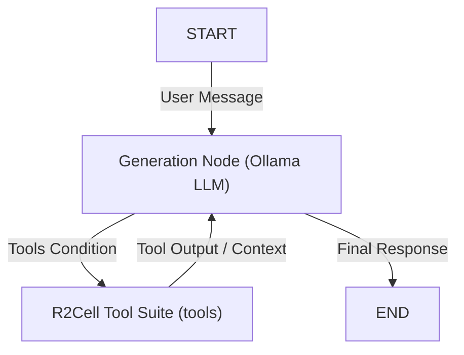

# R2CELL Service Gateway & TUI Dashboard

Welcome to the R2CELL Service Gateway and Terminal UI (TUI) Dashboard. This project provides a unified console control center to run, monitor, and manage the three core services that power the WhatsApp AI bot system:
1. **FastAPI Backend** (Python uvicorn API & metrics router)
2. **WhatsApp Gateway** (Node.js/Baileys API connector)
3. **Web Dashboard** (Vue 3/Vite frontend client)

---

## 🤖 The R2CELL AI Engine (LangChain & LangGraph)

At the heart of the R2CELL system is a sophisticated, stateful **Retrieval-Augmented Generation (RAG)** conversational AI built on top of **LangChain** and **LangGraph**. The AI acts as a digital customer service and sales agent, designed to represent R2CELL with high professionalism, polite behavior, and 100% factual accuracy.

### ⛓️ LangGraph Workflow Architecture
Unlike standard stateless chatbots, the AI engine is built as an orchestration graph using LangGraph. This ensures a clean separation of concerns and robust multi-step reasoning capabilities through dynamic tool call routing loops.



1. **Generation Node (`call_model`)**:
   - Prepares the conversation history and prepends the official **R2CELL system prompt**.
   - Invokes the `gemma4:31b-cloud` model via **LangChain Ollama** (`ChatOllama`) with a low temperature configuration (`0.1`) to ensure strict factual adherence and completely prevent hallucinations.
   - Decides if tools are needed (conditional routing) or produces the final user response.

2. **Agent Tool Suite Node (`tools`)**:
   - Executes the requested tools dynamically:
     - `query_knowledge_base`: Queries the Chroma vector database for RAG context.
     - `query_products`: Queries the SQLite database for phone models, grades, stock, and pricing.
     - `book_cod_appointment`: Validates inventory, schedules a Cash-on-Delivery meetup, decrements stock, and registers the booking.
     - `get_bandung_gmaps_location`: Returns R2Cell Bandung office coordinates and Google Maps pin link.
   - Piles the output context back into the `call_model` node to loop back to the generation node.

3. **Checkpointer Memory Persistence**:
   - Uses `SqliteSaver` checkpointer memory to bind conversations to specific thread IDs (mapped directly to the user's WhatsApp phone identifier or JID).
   - This provides persistent conversation sessions so the agent remembers previous customer interactions across restarts.

---

## ✨ Core AI & System Features

### 📖 Dynamic Document Ingestion (RAG)
* **Chroma Vector Store**: Document embeddings are computed and stored locally in Chroma DB, making the AI's search lightning fast.
* **On-the-Fly Document Upload**: Through the web dashboard or direct API, administrators can upload official catalogs, price sheets, and company profiles in PDF format.
* **Auto-Reindexing Pipeline**: When a PDF is uploaded, the system parses the document (`PyPDFLoader`), breaks it into logical chunks (`RecursiveCharacterTextSplitter`), updates embeddings, and re-indexes the Chroma database automatically.

### 🛍️ SQLite Products Inventory Database
* **Seeded Brands & SKUs**: Seeded with real-world inventory data for major smartphone brands: **Apple** (iPhone 13, 14, 15 series), **Samsung** (Galaxy S22, S23, S24 series, and A-series), **Google** (Pixel 7, 8 series), **Xiaomi** (Xiaomi 14, Redmi series), and **Poco** (F6 Pro).
* **Cosmetic Grading & Pricing**: Each SKU maps to distinct cosmetic grades: **Like New**, **Grade A**, **Grade B**, and **Grade C+**, with corresponding graded pricing levels.
* **Stock Levels**: Real-time stock counts initialized to a default seed value of 10 units, allowing realistic sales decrement operations.

### 📦 Cash-on-Delivery (COD) Booking Engine
* **Automated Scheduling**: Customers can schedule Cash-on-Delivery appointments directly via WhatsApp dialogue.
* **Inventory & Price Validation**: Before scheduling, the tool dynamically validates stock availability and price for the chosen model, storage, and cosmetic grade combination.
* **Stock Auto-Decrement**: On successful booking creation, the engine updates the inventory by decrementing the selected item's stock count.
* **Status Lifecycle**: Booking entries are created as `Pending` and can be transitioned to `Confirmed`, `Completed`, or `Cancelled` by administrators.

### 📍 Bandung Office Location & Pin Integration
* **Central Hub Location**: Located at **R2Cell Bandung Central Hub** (Jl. Asia Afrika No. 140, Bandung).
* **Google Maps Pin**: Configured with coordinates `-6.917464, 107.619122` and serves the exact Google Maps link (`https://maps.google.com/?q=-6.917464,107.619122`) to customers requesting meetup locations.

### 🛡️ Guardrails & Factual Adherence
* **Anti-Hallucination Prompts**: The generation model is heavily restricted. If a customer asks about a price, specifications, or policies not covered in the retrieved official context, the bot will gracefully decline to speculate, and offer to escalate to human support.
* **Polite, Sales-Centric Persona**: Programmed to maintain a helpful, warm tone focused on certified pre-owned smartphones (such as iPhones), mobile accessories, and wholesale/retail distribution.

### 💬 Human-like Conversational Pacing on WhatsApp
* **Message Bubble Splitting**: Rather than dumping long blocks of text on customers, the WhatsApp gateway dynamically splits the AI's response by paragraphs into multiple sequential chat bubbles.
* **Typing Indicator Simulation**: Sends a `composing` (typing...) presence update to the sender.
* **Dynamic Pacing Delays**: Calculates realistic typing durations proportional to the length of each bubble (e.g. 20ms per character, clamped between 1s and 3.5s) and adds natural pauses between messages to mimic a live customer service agent.

---

## 📸 Dashboard Preview

The TUI features a modern, clean dark-mode interface styled with high-contrast pastel colors (blue, green, orange, red) to provide glanceable feedback:

* **Left Panel:** Service health cards with reactive status dots, metrics indicators, action toggles, and shortcut links.
* **Right Panel:** Tabbed logging pane displaying real-time tail logs for the API, WhatsApp, and Web services.
* **Popup Overlays:** Includes a reactive WhatsApp scan modal (with timer and instructions), action confirmations, and a help window.

---

## 🚀 Getting Started

### Prerequisites
* **Python 3.10+** (with virtual environment)
* **Node.js 18+** (and npm)
* **WhatsApp** on a mobile device

### Installation
1. Clone the repository and navigate to the project directory:
   ```bash
   cd ai-r2cell
   ```
2. Set up the Python virtual environment and install dependencies:
   ```bash
   python -m venv venv
   # On Windows:
   .\venv\Scripts\Activate.ps1
   # On Unix:
   source venv/bin/activate

   pip install -r requirements.txt
   ```
3. Install Node.js dependencies for the WhatsApp Gateway:
   ```bash
   npm install
   ```
4. Install Node.js dependencies for the Web Dashboard:
   ```bash
   cd admin-dashboard
   npm install
   cd ..
   ```

### Running the Dashboard
Launch the unified dashboard directly from your terminal:
```bash
python tui.py
```
This automatically boots all three services in isolated background processes and starts streaming their logs.

---

## 🛠 Keyboard Shortcuts

Press these keys at any time while the TUI is focused to navigate and trigger actions:

| Key | Action | Description |
|:---:|:---|:---|
| `q` | **Quit** | Terminate the TUI and kill all active child/spawned services gracefully. |
| `r` | **Restart Services** | Hard stop and restart all three gateway services. |
| `1` | **FastAPI Logs** | Switch the active log pane view to the FastAPI Backend logs. |
| `2` | **WhatsApp Logs** | Switch the active log pane view to the Baileys Gateway logs. |
| `3` | **Web Logs** | Switch the active log pane view to the Vue Frontend logs. |
| `c` | **Clear Log** | Clear the contents of the log file for the active tab. |
| `?` | **Help** | Display the Help Overlay listing keyboard shortcuts. |
| `Esc` | **Close Overlay** | Close any active modal (Help, QR Code, or Reset Confirmation). |

---

## 🔍 Core Features & Functionality

### 1. Per-Service Action Toggles & Port Listening
* Each service card has an individual **Start/Stop** toggle button.
* If a service is stopped, its status changes to `offline` and its status dot turns grey.
* Clicking **Start** spawns the service in the background and sets its status dot to yellow (`booting` / `connecting`).
* When active, the TUI queries endpoints to check connection health, changing the dot to green (`online` / `running` / `authenticated`).

### 2. Connection Health & Live Metrics Indicators
The dashboard gathers live telemetry from the services and updates the UI cards in real time:
* **FastAPI Backend:** Displays total HTTP request count (excluding poll requests) and the time elapsed since the last request (e.g. `2 reqs, last: 12s ago`).
* **WhatsApp Gateway:** Displays current connection uptime, message transmission count (e.g. `10m 5s, 42 msgs`), and details on configuration/network errors.
* **Web Dashboard:** Monitors the Vite hot-reloading dev server and reports active client browser connections.

### 3. Integrated Real-Time Logging System
* Logs for each service are piped into central, designated log files inside the `logs/` folder (`fastapi.log`, `baileys.log`, `frontend.log`).
* **TUI Logging & Standalone Compatibility:** Spawning services via the TUI injects `R2CELL_TUI=true` into the environment. When detected, the service prints output straight to stdout (which the TUI intercepts and writes to the log file). When services are run manually via the console, they write directly to their log files to prevent log duplication.
* **Tailing Engine:** A background asyncio worker reads new log lines every 300ms, coloring lines containing `ERROR`/`FAIL` (red), `WARN` (yellow), and `SUCCESS` (green) for quick diagnostic readability.

### 4. Interactive QR Takeover Modal
* When the Baileys connector enters the `QR_PENDING` state, the TUI intercepts the state change and automatically overlays a **prominent QR Code Modal Screen**.
* **Double-Width Half-Blocks:** The QR code is printed using Unicode block elements (`▀▀`, `▄▄`, `██`, `  `). This double-width rendering ensures a perfect square aspect ratio on all terminal fonts and line layouts.
* **Color Mapping:** The QR code blocks are rendered in black text on a white widget background. This matches the standard QR code structure, ensuring it scans instantly with any mobile device camera.
* **Auto-refresh and Timeout:** Features a **60-second countdown timer** that ticks down to inform the user of QR freshness. The timer automatically resets to 60s whenever Baileys publishes a new QR string, and the modal automatically dismisses once the connection becomes `AUTHENTICATED`.

### 5. Secure Session Reset Dialog
* Clicking the **Reset WhatsApp** button prompts the user with a confirmation screen.
* Confirming the reset fires a `POST /wa/reset-session` request to the backend.
* The backend stops the running Node process by PID, wipes the `auth_info_baileys` credentials folder clean, and restarts Node to display a fresh scan QR code.

### 6. Unexpected Disconnect Flash Alerts
* If the WhatsApp state transitions from `AUTHENTICATED` to `DISCONNECTED` unexpectedly (e.g. when logged out from linked devices on a phone), the TUI acts immediately:
  * Triggers a warning toast notification at the bottom right.
  * Flashes the border of the WhatsApp Gateway card in red with a double-line border styling (`.flash-error`) to capture the user's attention.

---

## 🌐 Web Admin Dashboard

In addition to the terminal console, a premium **Web Admin Dashboard** is provided to manage the bot's stateful memories, configure RAG files, and monitor conversations.

### 1. Ingested Files (RAG Document Explorer)
* **PDF Upload & Ingestion**: Drop or select PDF documents (catalogs, specifications, company profiles). The backend automatically splits, embeds, and indexes them into ChromaDB.
* **Inline PDF Preview Modal**: Preview documents directly within the dashboard. The PDF is fetched, converted to a Base64-encoded string, and served as a local Blob URL, completely evading Internet Download Manager (IDM) interception.
* **Delete & Re-index**: Delete documents to instantly purge their corresponding vector embeddings from ChromaDB.

### 2. Conversations Manager (Memory Reset Control)
* **Real-Time Thread Inspection**: Fetches active client JIDs (phone numbers) and turns directly from the SQLite `checkpoints` database.
* **Chronological Chat Bubbles**: View full dialogue histories in user vs. bot chat bubbles.
* **AI Session Memory Wiping**: Reset the AI's conversation memory for a single contact or globally. This deletes checkpoint records, letting the chatbot start fresh next time the user messages the WhatsApp gateway.

### 3. Phone Inventory Panel & Draggable Modal
* **Stock & SKU Management**: Browse the entire database inventory of phones. Filter by brand, cosmetic grade, or search by model name.
* **Draggable Modal Form**: Add new devices or edit prices/stock levels using a fully custom draggable modal panel. This modal uses reactive mouse event-listeners, allowing administrators to position it anywhere on their screen without obstructing data views.

### 4. COD Bookings Panel
* **Appointment Tracking**: View all COD meetups scheduled by the WhatsApp AI. Inspect customer details, selected device models, schedule dates/times, and price details.
* **Status Transition Control**: Update appointment statuses (Pending, Confirmed, Completed, Cancelled) dynamically from a dropdown selector.

### 5. Interactive Graph Visualizer with Tool Node Details
* **Flow State Inspection**: Monitors active conversation paths on the compiled LangGraph in real time.
* **Dynamic Tools List**: The `tools` execution node in the flow diagram lists active agent tools: **Knowledge Base RAG**, **Product Stock Query**, **COD Booking Engine**, and **Bandung Maps Location**.

### 6. Mobile Responsiveness & Aesthetics
* **Responsive Layout Shifts**: Uses a responsive split layout. On mobile screens (< 768px), large data lists and tables automatically collapse into clean card layouts.
* **Native-Feeling Mobile Chat**: On mobile viewports, the Conversations panel switches between a list view and a chat logs view (equipped with a header back button) mimicking a native mobile chat application.
* **Slate/Zinc Minimalist Styling**: Supports a cohesive dark and light theme toggle using Tailwind CSS v4 variant classes and standard zinc palettes (free of high-contrast glow shadows or neon outlines).

---

## 📁 File Structure

```plaintext
ai-r2cell/
├── admin-dashboard/         # Vue 3 / Vite Web Client
│   ├── src/
│   │   ├── components/      
│   │   │   ├── products/
│   │   │   │   └── ProductModal.vue # Draggable modal form for products
│   │   │   ├── DocumentTable.vue
│   │   │   ├── Navbar.vue
│   │   │   ├── Sidebar.vue
│   │   │   └── PdfPreviewModal.vue
│   │   ├── layouts/         # DashboardLayout
│   │   ├── router/          # Vue Router configuration
│   │   ├── views/           
│   │   │   ├── DashboardView.vue
│   │   │   ├── KnowledgeBaseView.vue
│   │   │   ├── ConversationsView.vue
│   │   │   ├── ProductsView.vue  # Phone Inventory Panel
│   │   │   ├── BookingsView.vue  # COD Bookings Panel
│   │   │   ├── GraphView.vue     # Dynamic Graph Visualizer
│   │   │   └── GatewayView.vue
│   │   ├── App.vue          # Root Vue component
│   │   ├── main.js          # Vite client entrypoint
│   │   └── style.css        # Tailwind CSS import & theme variants
│   └── package.json
│
├── logs/                    # Central log directory
│   ├── fastapi.log          # FastAPI server logs
│   ├── baileys.log          # Baileys gateway logs
│   └── frontend.log         # Web frontend dev logs
│
├── src/
│   ├── api/
│   │   ├── bookings.py      # REST endpoints for bookings
│   │   ├── chat.py          
│   │   ├── documents.py     
│   │   ├── gateway.py       
│   │   ├── graph.py         
│   │   └── products.py      # REST endpoints for products
│   │
│   ├── core/
│   │   ├── database.py      # SQLite connection & table seeding
│   │   ├── event_bus.py     
│   │   ├── gateway_state.py 
│   │   ├── metrics.py       
│   │   └── vectorstore.py
│   │
│   ├── integrations/
│   │   └── whatsapp/
│   │       └── whatsapp.js  # Node.js Baileys connector
│   │
│   ├── tools/
│   │   ├── booking.py       # LangChain tools for product query, booking & location
│   │   └── search.py        
│   │
│   ├── main.py              # FastAPI server & route registration
│   │
│   └── tui/                 # Terminal UI module
│       ├── app.py           # DashboardApp application driver
│       ├── widgets.py       # Custom Modals, QR display, and confirmations
│       └── theme.tcss       # Clean minimal dark-mode layout styling
│
└── tui.py                   # Terminal UI entrypoint script
```
