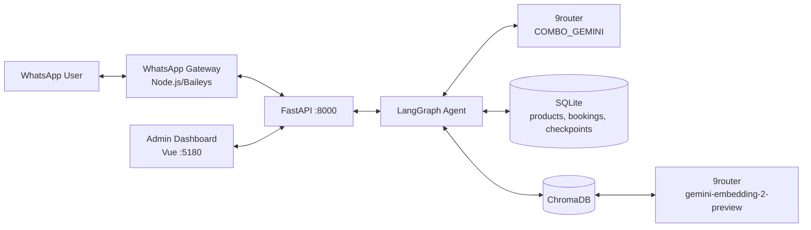
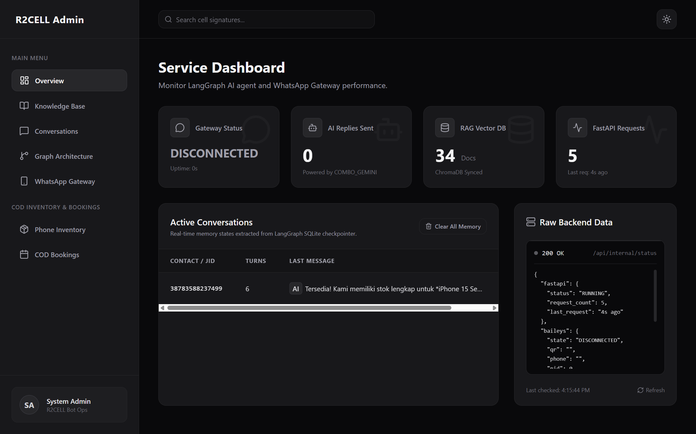
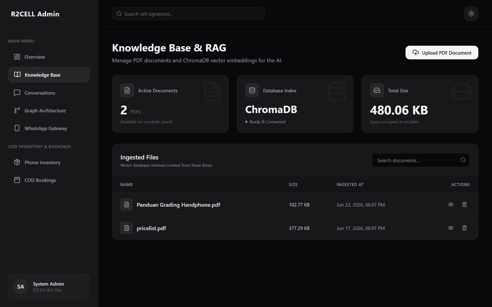
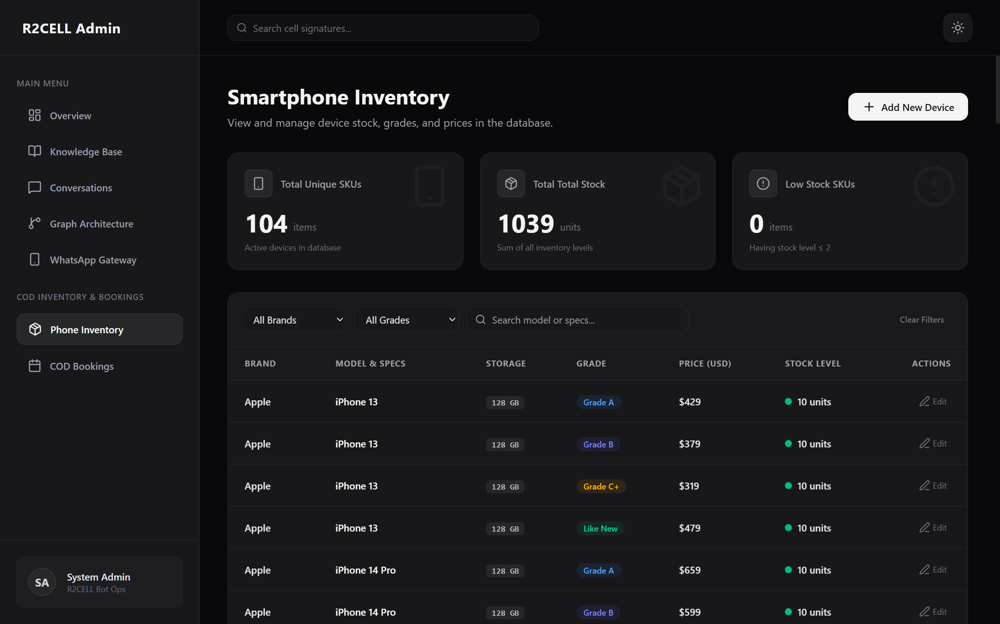
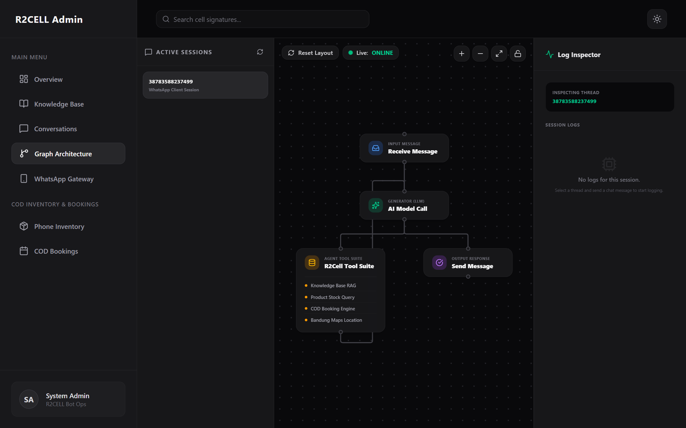

# R2CELL – WhatsApp AI Customer Service

A WhatsApp chatbot for R2Cell, a pre-owned phone store in Bandung. It answers grading and warranty questions with RAG over PDF documents, checks stock and prices in SQLite, books Cash-on-Delivery meetups, and shares the store location. Everything is monitored from a web admin dashboard and a terminal UI.

Stack: Python 3.10+, FastAPI, LangGraph/LangChain, ChromaDB, SQLite, Node.js + Baileys, Vue 3 + Vite + Tailwind v4. The chat LLM and the embedding model are both served by **9router**, an OpenAI-compatible API.

## Architecture


```mermaid
graph LR
    User[WhatsApp User] <--> WA[WhatsApp Gateway<br/>Node.js/Baileys]
    WA <--> API[FastAPI :8000]
    Dash[Admin Dashboard<br/>Vue :5180] <--> API
    API <--> Graph[LangGraph Agent]
    Graph <--> LLM[9router<br/>COMBO_GEMINI]
    Graph <--> SQLite[(SQLite<br/>products, bookings, checkpoints)]
    Graph <--> Chroma[(ChromaDB)]
    Chroma <--> Emb[9router<br/>gemini-embedding-2-preview]
```

The agent (`src/agents/main_agent/`) is a `call_model` ↔ `tools` loop:

- `call_model` calls the LLM through `ChatOpenAI` (`src/core/llm.py`) at temperature 0.1. FastAPI sends one warm-up request in the background on startup.
- Tools (`src/tools/`): `query_knowledge_base` (RAG, cosine, k=8, drops chunks below `RAG_MIN_RELEVANCE`), `query_products` (stock and prices from SQLite), `book_cod_appointment`, `get_bandung_gmaps_location`.
- Conversation memory is stored per WhatsApp contact with `SqliteSaver` (`checkpoints.db`).

## Setup

1. Create `.env` in the project root (never commit it):
   ```ini
   LLM_PROVIDER=9router
   LLM_API_BASE_URL=https://ai.qifor.my.id/v1
   LLM_API_KEY=your-9router-api-key
   LLM_MODEL=COMBO_GEMINI
   EMBEDDING_MODEL=gemini/gemini-embedding-2-preview
   # optional: RAG_CHUNK_SIZE=1200, RAG_CHUNK_OVERLAP=200, RAG_MIN_RELEVANCE=0.40
   ```
2. Install Python dependencies:
   ```bash
   python -m venv venv
   .\venv\Scripts\Activate.ps1
   pip install -r requirements.txt
   ```
3. Install Node dependencies:
   ```bash
   cd src/integrations/whatsapp && npm install && cd ../../..
   cd admin-dashboard && npm install && cd ..
   ```
4. Ingest the PDFs in `src/data/` into ChromaDB:
   ```bash
   python -c "from src.core.vectorstore import ingest_all_pdfs; ingest_all_pdfs()"
   ```
   Pages are cleaned first (browser print footers and price-table rows are dropped, since prices live in SQLite), split into 1200-character chunks, and embedded through 9router. **Re-run this whenever `EMBEDDING_MODEL` changes.**

## Running

```bash
python tui.py
```

The TUI starts all three services and shows their status and logs. To run them separately: `npm run start:backend`, `npm run start:wa`, `npm run start:frontend`. The backend listens on `http://localhost:8000` and the dashboard on `http://localhost:5180`.

TUI keys: `q` quit, `r` restart services, `1`/`2`/`3` switch log tab, `c` clear log, `?` help.

RAG evaluation (Ragas, using `src/evaluation/questions.json` and the 9router settings from `.env`):

```bash
python -m src.evaluation.cli --output-report rag_eval_report.md
```

## Screenshots

Service overview:


Knowledge base (PDFs ingested into ChromaDB):


Phone inventory:


LangGraph visualizer:


## Project Structure

```plaintext
admin-dashboard/          Vue 3 admin (overview, knowledge base, chats, graph, gateway, products, bookings)
src/
  agents/main_agent/      state, nodes, graph, prompts
  api/                    REST endpoints (chat, documents, products, bookings, gateway, graph)
  core/                   llm.py, vectorstore.py, database.py, metrics, event bus
  tools/                  LangChain tools (RAG, products, booking, location)
  evaluation/             Ragas evaluation pipeline
  integrations/whatsapp/  Baileys gateway (whatsapp.js)
  tui/                    terminal dashboard
  data/                   source PDFs + chroma_db
tui.py                    TUI entrypoint
```
